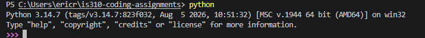
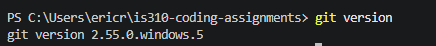
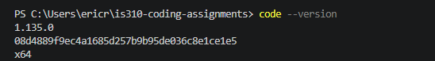

# Init IS310 Homework

## Proof of Installation

1. Python

2. Git

3. VS Code

4. Hypothesis Username
ecampos3

5. AI Tool/Workflow
Detail what AI tool, if any, do you plan to use this semester.
I do not plan on using any AI tool. If a programming challenge becomes too difficult and I genuinely need assistance, I would most likely use Copilot.