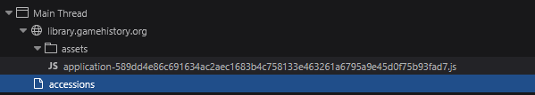
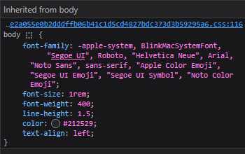

# Inspecting The Cultural Web - Assessment 

https://library.gamehistory.org/ 

 

1.  This website uses HTML5 and JavaScript. It also uses CSS.
I struggled to see any other file type while inspecting.

 

 

2. 
This website looks like it had a small team of people working on it.   When looking at a .JS file, there are 18,000 Lines. While I   cannot verify how many people worked on this website,   I can say that the website has been made by a non-profit.   According to them, they have limited staffing. 

 

 

